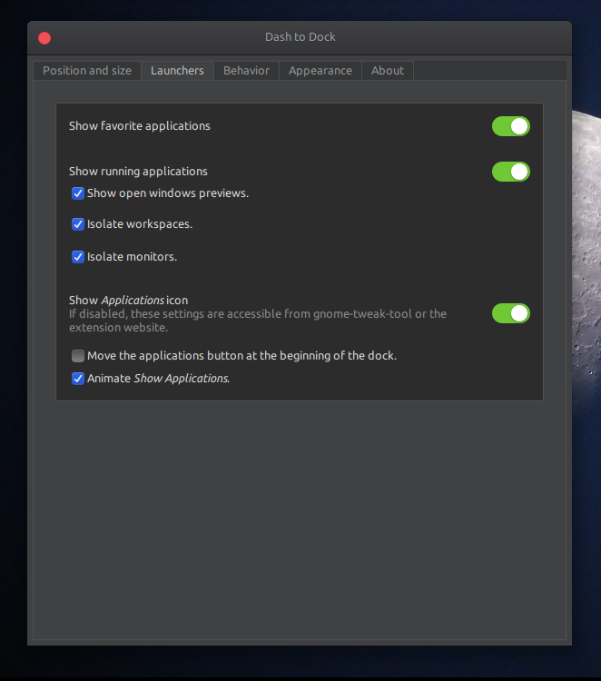
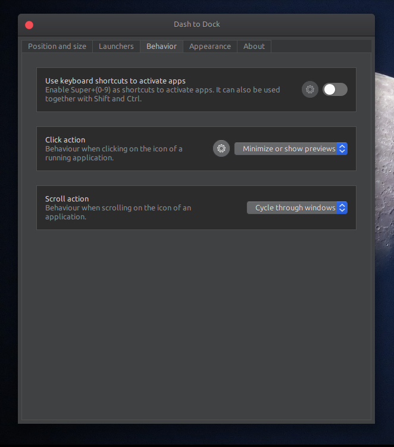
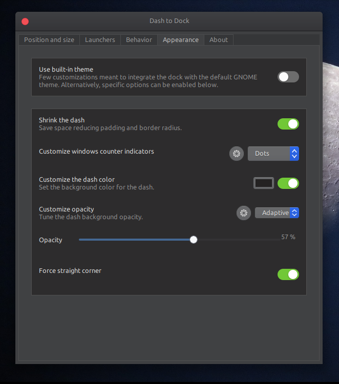
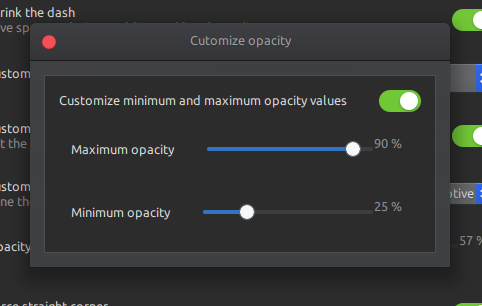

# My-Ubuntu-Customisation 🔧🔨🔩

                .-/+oossssssssoo+/-.               chaman@MY-CODE-LAPTOP
           `:+sssssssssssssssssssssss+:`           ---------------------
          -+ssssssssssssssssssssssyyssss+-         OS: Ubuntu 18.04.5 LTS x86_64
        .ossssssssssssssssssssssdMMMNysssso.       Host: 81DE Lenovo ideapad 330-15IKB
       /ssssssssssshdmmNNNNNNmmyNMMMMhssssss/      Kernel: 5.4.0-48-generic
      +ssssssssshmydMMMMMMMMMMMNddddyssssssss+     Uptime: 4 days, 1 hour, 12 mins
     /sssssssshNMMMyhhyyyyyyyyhmNMMMNhssssssss/    Packages: 2457
    .ssssssssdMMMNhsssssssssssssshNMMMdssssssss.   Shell: bash 4.4.20
    +sssshhhyNMMNyssssssssssssssssyNMMMysssssss+   Resolution: 1366x768
    ossyNMMMNyMMhsssssssssssssssssshmmmhssssssso   DE: GNOME 3.28.4
    ossyNMMMNyMMhsssssssssssssssssshmmmhssssssso   WM: GNOME Shell
    +sssshhhyNMMNyssssssssssssssssyNMMMysssssss+   WM Theme: Mc-OS-CTLina-Gnome-Dark-1.
    .ssssssssdMMMNhsssssssssssssshNMMMdssssssss.   Theme: Mc-OS-CTLina-Gnome-Dark-1.1 [
     /sssssssshNMMMyhhyyyyyyyyhdNMMMNhssssssss/    Icons: McMojave-circle-blue-dark [GT
      +sssssssssdmydMMMMMMMMMMMMddddyssssssss+     Terminal: gnome-terminal
       /ssssssssssshdmNNNNNNNNmyNMMMMhssssss/      CPU: Intel i5-8250U (8) @ 3.400GHz
        .ossssssssssssssssssssssdMMMNysssso.       GPU: NVIDIA GeForce MX150
          -+sssssssssssssssssssssyyyssss+-         GPU: Intel UHD Graphics 620
            `:+ssssssssssssssssssssss+:`           Memory: 4366MiB / 7869MiB
                .-/+oossssssssoo+/-.

## Screenshots

## First install Gnome Tweaks.

Run the following command to install the Gnome Tweak tool on Ubuntu 18.04:

    sudo apt install gnome-tweak-tool

### Enable user themes in Ubuntu 18.04

     sudo apt install gnome-shell-extensions

## Appearance:-

- **Applications Theme** - [Mc-OS-CTLina-Gnome-Dark-1.1](https://github.com/paullinuxthemer/Mc-OS-themes)
- **Cursor Theme** - [Capitaine](https://github.com/keeferrourke/capitaine-cursors) (dark is my default)
- **icon Theme** - [McMojave-circle-blue-dark](https://github.com/vinceliuice/McMojave-circle)
- **Shell Theme** - Mc-OS-CTLina-Gnome-Dark-1.1
- **Wallpaper** - [My Wallpaper](wallpapers/Moon.jpg)

## Extensions:-

- **Add username to top panel** [ [Download](https://extensions.gnome.org/extension/1108/add-username-to-top-panel/) ]
  > simply add your username to topbar aggregate menu
- **Applications menu** [ Enable it in tweaks ]
  > Add a category-based menu for applications.
- **Clipboard indicator** [ [Download](https://extensions.gnome.org/extension/779/clipboard-indicator/) ]
  > Clipboard Manager extension for Gnome-Shell - Adds a clipboard indicator to the top panel, and caches clipboard history.
- **Dash to dock** [ [Download](https://extensions.gnome.org/extension/307/dash-to-dock/) ]

  > A dock for the Gnome Shell. This extension moves the dash out of the overview transforming it in a dock for an easier launching of applications and a faster switching between windows and desktops. Side and bottom placement options are available.  
  >  **- Setting Screenshots**
  >
  > >   
  > >   
  > >   
  > > 
  > >
  > > >   
  > > > 

  > **Note:** _desh to dock_ have some isssue with _ubuntu dock_ so After these setting disable desh to dock extenton in _gnome-tweaks_ this will keeps the setting as it is but the ubuntu dock issus is solved.

- **Frippery move clock** [ [Download](https://extensions.gnome.org/extension/2/move-clock/) ]

  > Move clock to left of status menu button.

- **Gsconnect** [[Download](https://extensions.gnome.org/extension/1319/gsconnect/)]

  > GSConnect is a complete implementation of KDE Connect especially for GNOME Shell with Nautilus, Chrome and Firefox integration. It does not rely on the KDE Connect desktop application and will not work with it installed.  
  > KDE Connect allows devices to securely share content like notifications or files and other features like SMS messaging and remote control. The KDE Connect team has applications for Linux, BSD, Android, Sailfish and Windows.

- **Panel osd** [ Download ](https://extensions.gnome.org/extension/708/panel-osd/)
  > Configuring where on the (main) screen notifications will appear, instead of just above the massage tray.
