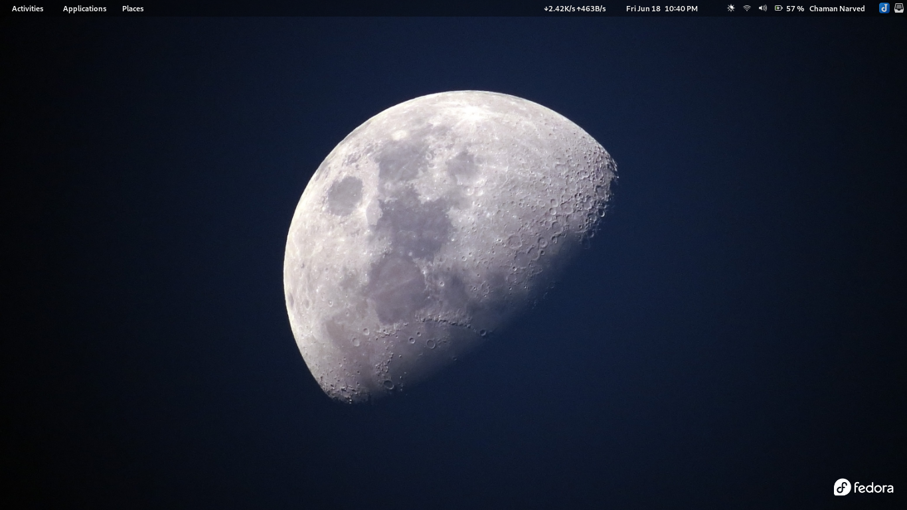
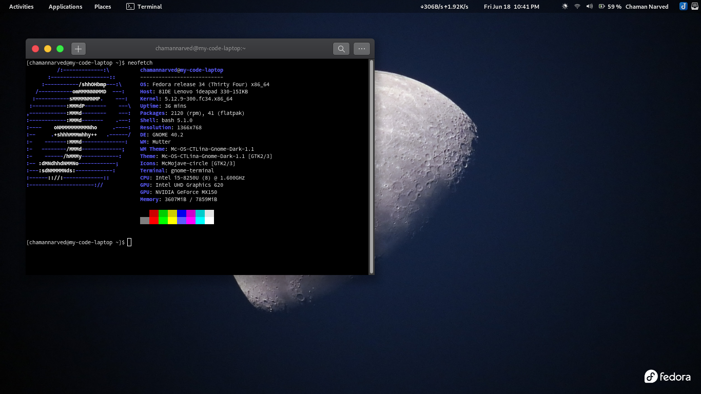
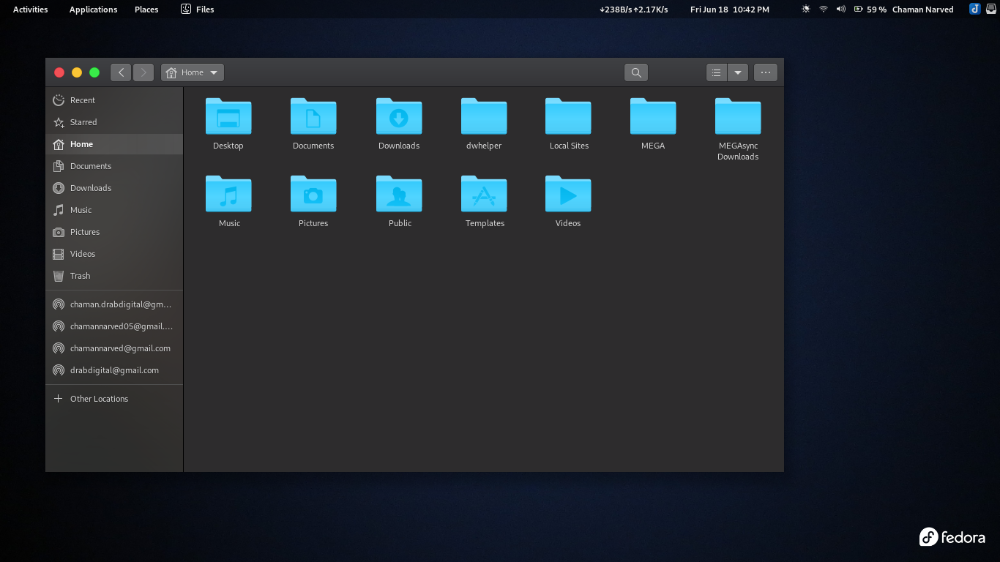
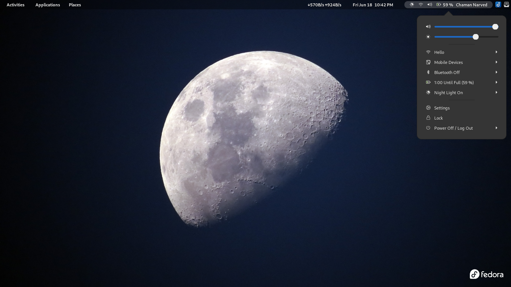

> **Note:** Switch to deffrent branch for other OS customizations. 

# My-Fadora-Customization 🔧🔨🔩
 
              /:-------------:\          chamannarved@my-code-laptop 
           :-------------------::        --------------------------- 
         :-----------/shhOHbmp---:\      OS: Fedora release 34 (Thirty Four) x86_64 
       /-----------omMMMNNNMMD  ---:     Host: 81DE Lenovo ideapad 330-15IKB 
      :-----------sMMMMNMNMP.    ---:    Kernel: 5.12.9-300.fc34.x86_64 
     :-----------:MMMdP-------    ---\   Uptime: 36 mins      
    ,------------:MMMd--------    ---:   Packages: 2120 (rpm), 41 (flatpak) 
    :------------:MMMd-------    .---:   Shell: bash 5.1.0 
    :----    oNMMMMMMMMMNho     .----:   Resolution: 1366x768 
    :--     .+shhhMMMmhhy++   .------/   DE: GNOME 40.2 
    :-    -------:MMMd--------------:    WM: Mutter 
    :-   --------/MMMd-------------;     WM Theme: Mc-OS-CTLina-Gnome-Dark-1.1 
    :-    ------/hMMMy------------:      Theme: Mc-OS-CTLina-Gnome-Dark-1.1 [GTK2/3] 
    :-- :dMNdhhdNMMNo------------;       Icons: McMojave-circle [GTK2/3] 
    :---:sdNMMMMNds:------------:        Terminal: gnome-terminal 
    :------:://:-------------::          CPU: Intel i5-8250U (8) @ 1.600GHz 
    :---------------------://            GPU: Intel UHD Graphics 620 
                                         GPU: NVIDIA GeForce MX150 
                                         Memory: 3607MiB / 7859MiB 

## Screenshots

## First install Gnome Tweaks.

Run the following command to install the Gnome Tweak tool on Fedora 34 workstation:

    sudo dnf install gnome-tweak-tool

### Enable user themes in Fedora 34 workstation:

     sudo dnf install gnome-shell-extensions

## Appearance:-

- **Applications Theme** - [Mc-OS-CTLina-Gnome-Dark-1.1](https://github.com/paullinuxthemer/Mc-OS-themes)
- **Cursor Theme** - [Capitaine](https://github.com/keeferrourke/capitaine-cursors) (dark is my default)
- **icon Theme** - [McMojave-circle-blue-dark](https://github.com/vinceliuice/McMojave-circle)
- **Shell Theme** - Mc-OS-CTLina-Gnome-Dark-1.1
- **Wallpaper** - [My Wallpaper](wallpapers/Moon.jpg)

## Extensions:-

- **Add username to top panel** [ [Download](https://extensions.gnome.org/extension/1108/add-username-to-top-panel/) ]
  > simply add your username to topbar aggregate menu
- **Applications menu** [ Enable it in tweaks ]
  > Add a category-based menu for applications.
- **Clipboard indicator** [ [Download](https://extensions.gnome.org/extension/779/clipboard-indicator/) ]
  > Clipboard Manager extension for Gnome-Shell - Adds a clipboard indicator to the top panel, and caches clipboard history.

- **Frippery move clock** [ [Download](https://extensions.gnome.org/extension/2/move-clock/) ]

  > Move clock to left of status menu button.

- **Gsconnect** [ [Download](https://extensions.gnome.org/extension/1319/gsconnect/) ]

  > GSConnect is a complete implementation of KDE Connect especially for GNOME Shell with Nautilus, Chrome and Firefox integration. It does not rely on the KDE Connect desktop application and will not work with it installed.  
  > KDE Connect allows devices to securely share content like notifications or files and other features like SMS messaging and remote control. The KDE Connect team has applications for Linux, BSD, Android, Sailfish and Windows.

- **Panel osd** [ [ Download ](https://extensions.gnome.org/extension/708/panel-osd/) ]

  > Configuring where on the (main) screen notifications will appear, instead of just above the massage tray.

- **Simple net speed** [ [Download](https://extensions.gnome.org/extension/1085/simple-net-speed/) ]
  > Simply showing network speed. Left click to change modes.

## Tweaks Settting (Optional)

Only for small screens like leptops :-

- **Fonts** (Open tweaks and goto **fonts**)
  > Set **scaling fector** to **0.80**
